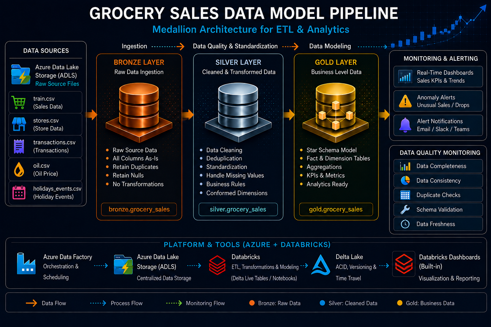
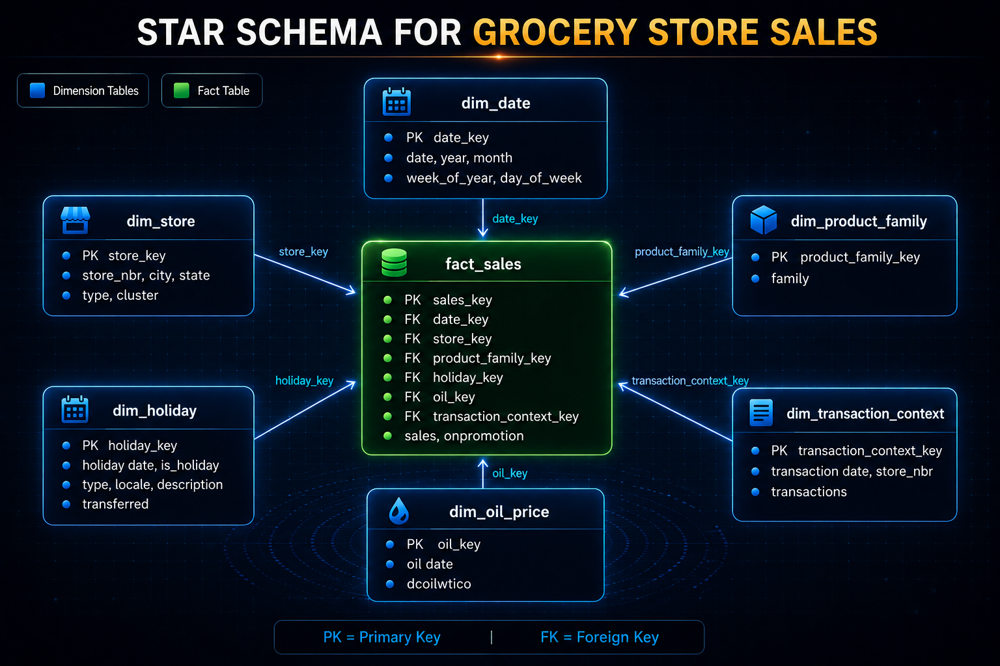
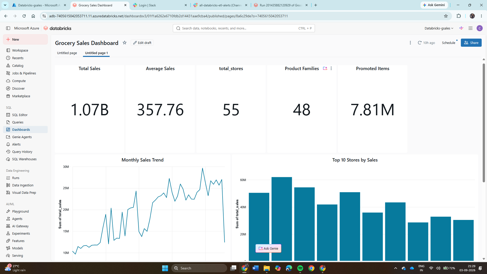
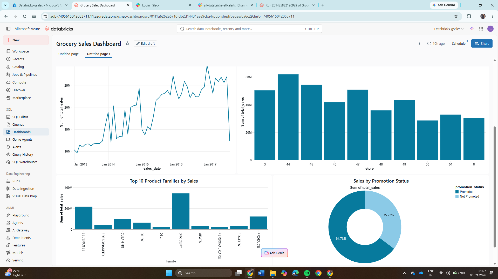

# Grocery Sales Data Engineering Pipeline

## 🚀 Project Overview

The **Grocery Sales Data Engineering Pipeline** is an end-to-end Data Engineering project built to process grocery sales data and prepare clean, analytics-ready datasets for business reporting.

The project follows the **Medallion Architecture (Bronze → Silver → Gold)** using Azure Databricks. Raw grocery sales data is stored in Azure Data Lake Storage Gen2, transformed using PySpark and dbt, managed through Unity Catalog, validated using PyTest, and used to build Databricks dashboards.

Databricks Jobs are used to execute the Silver → Gold → Data Quality workflow, with Slack notifications configured for pipeline monitoring.

---

## 🎯 Project Objectives

The main objectives of this project are:

- Build an end-to-end grocery sales data pipeline.
- Store source data using Azure Data Lake Storage Gen2.
- Implement Medallion Architecture using Bronze, Silver, and Gold layers.
- Clean and transform raw grocery sales data.
- Build reusable transformations using PySpark and dbt.
- Create business-level Gold tables for sales analysis.
- Build interactive dashboards in Databricks.
- Implement automated data quality checks using PyTest.
- Configure Slack notifications for ETL job monitoring.
- Orchestrate the ETL workflow using Apache Airflow.

---

## 🏗 Lakehouse Architecture

The project follows a Lakehouse-based Data Engineering Architecture.

```text
Source Grocery Sales Data
          ↓
Azure Data Lake Storage Gen2
          ↓
       Bronze
          ↓
       Silver
          ↓
        Gold
          ↓
   Data Quality - PyTest
          ↓
 Databricks Dashboards
          ↓
     Business Insights

Databricks Job
     ↓
Silver → Gold → PyTest
     ↓
Slack Notifications

Apache Airflow
     ↓
Databricks ETL Workflow
```

### High Level Design



---

## 🛠 Technology Stack

| Technology | Purpose |
|---|---|
| Azure Data Lake Storage Gen2 | Data Lake Storage |
| Azure Databricks | Data Processing and ETL |
| PySpark | Data Cleaning and Transformation |
| Delta Lake | Lakehouse Table Storage |
| Unity Catalog | Data Governance and Access Management |
| dbt | Data Transformation and Modelling |
| PyTest | Data Validation and Data Quality Testing |
| Databricks SQL | Analytics and Dashboard Queries |
| Databricks Jobs | ETL Workflow Execution |
| Slack | Pipeline Success/Failure Notifications |
| Apache Airflow | Pipeline Orchestration |
| GitHub | Version Control and Project Repository |

---

## 📂 Dataset

The project uses grocery sales datasets containing historical sales, stores, transactions, oil prices, holidays, and promotion information.

### Source Files

| Dataset |
|---|
| `train.csv` |
| `test.csv` |
| `stores.csv` |
| `transactions.csv` |
| `oil.csv` |
| `holidays_events.csv` |

The source files are stored in **Azure Data Lake Storage Gen2**.

The large `train.csv` file is not included in the GitHub repository if it exceeds GitHub's normal file upload limit.

---

## 🏗 ETL Design - Medallion Architecture

### 🥉 Bronze Layer – Raw Data

The Bronze layer contains the raw grocery sales data.

- Loaded source datasets from ADLS Gen2.
- Created Bronze tables in Databricks.
- Preserved source-level data for further processing.
- Used Unity Catalog to organize and manage the tables.

### Bronze Tables

| Table |
|---|
| `train` |
| `test` |
| `stores` |
| `transactions` |
| `oil` |
| `holidays_events` |

---

### 🥈 Silver Layer – Data Cleaning & Transformation

The Silver layer contains cleaned and standardized data.

Main transformations include:

- Converted columns to required data types.
- Converted date columns to Date type.
- Trimmed string values.
- Removed records with null values in critical columns.
- Removed duplicate records using `ROW_NUMBER()`.
- Handled duplicate IDs and store numbers.
- Removed invalid negative sales values.
- Prepared clean datasets for Gold-level processing.

### Silver Tables

| Table |
|---|
| `silver_train` |
| `silver_test` |
| `silver_stores` |
| `silver_transactions` |
| `silver_oil` |
| `silver_holidays_events` |

---

### 🥇 Gold Layer – Business Analytics

The Gold layer contains aggregated datasets created for business reporting and dashboard analysis.

### Gold Tables

| Gold Table | Purpose |
|---|---|
| `gold_daily_sales` | Daily sales analysis |
| `gold_store_performance` | Store-wise sales performance |
| `gold_family_sales` | Product family sales analysis |
| `gold_promotion_analysis` | Promoted vs non-promoted sales analysis |
| `gold_monthly_sales` | Monthly sales trends |
| `gold_sales_summary` | Overall business KPI summary |

The Gold layer is used directly for Databricks dashboard reporting.

---

## 📐 Data Model

The project data model represents the relationship between grocery sales, stores, transactions, promotions, holidays, and other supporting datasets.




---

## 📊 Business Insights

The Gold tables provide business insights such as:

### Sales Analysis

- Overall grocery sales
- Average sales
- Daily sales trends
- Monthly sales trends

### Store Analysis

- Top-performing stores
- Store-wise total sales
- Store location and type-based analysis

### Product Analysis

- Top-performing product families
- Product family-wise total and average sales

### Promotion Analysis

- Promoted vs non-promoted sales
- Number of promoted items
- Promotion-based sales performance

---

## 📊 Databricks Dashboard

A **Grocery Sales Dashboard** was built using Gold tables in Databricks.

The dashboard contains:

- Total Sales
- Average Sales
- Total Stores
- Total Product Families
- Total Promoted Items
- Monthly Sales Trend
- Top 10 Stores
- Top Product Families
- Sales by Promotion Status

### Dashboard



### Additional Analysis



> Update the image names if your uploaded screenshots have different filenames.

---

## 🔧 Data Build Tool (dbt)

dbt was integrated with Azure Databricks for developing the Silver and Gold transformation models.

- Connected dbt Cloud with the Databricks SQL Warehouse.
- Configured the Unity Catalog catalog and schemas.
- Created source definitions for Bronze tables.
- Developed Silver models for data cleaning and standardization.
- Developed Gold models for business-level aggregations.
- Used dbt tests such as `not_null` and `unique`.
- Used dbt test failures to identify data quality issues.
- Materialized transformed models as tables in Databricks.

The Silver and Gold transformations were initially developed using **dbt models**. Databricks notebook tasks were later created to orchestrate and monitor the Silver-to-Gold ETL workflow.

---

## 🔄 Databricks ETL Workflow

The Silver, Gold, and testing processes are integrated into a Databricks Job.

### Workflow

```text
silver_task
     ↓
gold_task
     ↓
data_quality_test_task
```

### `silver_task`

Runs the Silver transformation notebook and creates cleaned Silver tables from Bronze data.

### `gold_task`

Runs the Gold transformation notebook and creates all required Gold analytics tables.

### `data_quality_test_task`

Runs automated PyTest data quality checks after the Gold transformation completes.

Task dependencies ensure that each stage starts only after the previous stage succeeds.

---

## ⚠️ Slack Alerts & Monitoring

Slack notifications are integrated with the Databricks ETL workflow for monitoring.

### Configuration

1. Created a Slack workspace/channel for ETL alerts.
2. Created a Slack App.
3. Enabled Incoming Webhooks.
4. Generated a webhook URL for the Slack channel.
5. Created a Slack Notification Destination in Databricks.
6. Connected the notification destination to the Databricks Job.
7. Enabled notifications for:
   - Job Start
   - Job Success
   - Job Failure

### Monitoring Flow

```text
Databricks Job
      ↓
Silver → Gold → PyTest
      ↓
Overall Job Status
      ↓
Slack Notification
```

If any transformation or PyTest task fails, the overall Databricks Job fails and a failure notification is sent to Slack.

Slack therefore reduces the need to manually monitor every pipeline execution in Databricks.

---

## ✅ Data Quality & Testing using PyTest

Automated data quality checks were implemented using **PyTest**.

The tests validate both Silver and Gold data.

### Validation Checks

- Silver table is not empty.
- Critical columns do not contain null values.
- IDs do not contain duplicates.
- Sales values are not negative.
- Store numbers are unique.
- Gold sales summary contains data.
- Gold total sales is positive.
- All required Gold tables contain records.

During testing, PyTest identified **10 negative sales records**.

The Silver transformation was updated to remove invalid negative sales values, after which the Silver and Gold layers were rebuilt.

Final test execution:

```text
8 passed
ALL DATA QUALITY TESTS PASSED
```

PyTest is integrated as the final task in the Databricks ETL workflow.

```text
Silver Transformation
        ↓
Gold Transformation
        ↓
PyTest Validation
        ↓
Job Success / Failure
        ↓
Slack Notification
```

---

## 🔄 Apache Airflow - Pipeline Orchestration

Apache Airflow is included as the orchestration layer for the project.

The planned orchestration flow is:

```text
Apache Airflow DAG
        ↓
Trigger Databricks ETL Job
        ↓
silver_task
        ↓
gold_task
        ↓
data_quality_test_task
        ↓
Job Status
        ↓
Slack Notification
```

Airflow will be used to:

- Schedule ETL workflow execution.
- Trigger the Databricks Job.
- Manage workflow dependencies.
- Monitor execution status.
- Support retry and failure handling.

> **Status:** Airflow orchestration integration is currently in progress and will be added to the repository after completion.

This section will be updated with the Airflow DAG and execution screenshots once implementation is complete.

---

## ⚠️ Alerts, Monitoring & Logging

The project uses:

- Databricks Job monitoring for ETL execution.
- Slack notifications for Start, Success, and Failure events.
- PyTest failures to stop unsuccessful data-quality runs.
- Databricks execution logs for troubleshooting.
- Airflow orchestration and monitoring after integration.

---

## 👩‍💻 My Role

**Role: Build test cases for data validation and data quality checks using PyTest**

My responsibilities included:

- Created PyTest test cases for Silver and Gold data.
- Checked null values, duplicate records, and invalid sales values.
- Identified negative sales records during testing.
- Updated the Silver transformation to handle the identified data issue.
- Validated that Gold tables contained valid data.
- Executed the complete test suite and verified all 8 tests passed.
- Added the PyTest notebook as a task after the Gold transformation in the Databricks Job.
- Verified data-quality test execution as part of the complete ETL workflow.

---

## 📈 Key Outcomes

- Implemented an end-to-end Medallion Architecture.
- Created clean and reusable Silver datasets.
- Created analytics-ready Gold datasets.
- Built a Databricks dashboard for grocery sales analysis.
- Automated data-quality validation using PyTest.
- Successfully executed 8 automated data-quality checks.
- Integrated Slack notifications for ETL monitoring.
- Created a dependent Databricks workflow for Silver → Gold → PyTest.
- Prepared the pipeline for Airflow-based orchestration.

---

## 📁 Repository Structure

```text
Grocery-Sales-Data-Engineering/
│
├── Alerts/
│   └── Slack alert screenshots/documentation
│
├── DashBoards/
│   ├── 01_grocery_sales_dashboard.png
│   └── 02_grocery_sales_analysis_charts.png
│
├── DataSets/
│   └── Grocery sales source datasets
│
├── Development/
│   ├── silver_pipeline.ipynb
│   └── gold_pipeline.ipynb
│
├── Test/
│   └── test_data_quality.ipynb
│
├── docs/
│   ├── HLD.png
│   └── Data_Model.png
│
└── README.md
```

---

## 🔮 Future Enhancements

- Complete Apache Airflow integration for automated orchestration.
- Add scheduled pipeline execution.
- Add additional data quality rules.
- Add CI/CD for automated deployment and testing.
- Extend dashboard analytics with additional business KPIs.
- Implement incremental data processing for new source data.

---

## 📌 Conclusion

This project demonstrates an end-to-end **Azure Data Engineering pipeline** for grocery sales data using ADLS Gen2, Azure Databricks, Unity Catalog, dbt, PySpark, PyTest, Databricks Dashboards, and Slack.

The project follows the **Bronze → Silver → Gold** Medallion Architecture to transform raw grocery sales data into clean, validated, analytics-ready datasets.

Automated PyTest validation and Slack monitoring improve data reliability and operational monitoring, while Apache Airflow is being added as the orchestration layer for automated pipeline execution.
